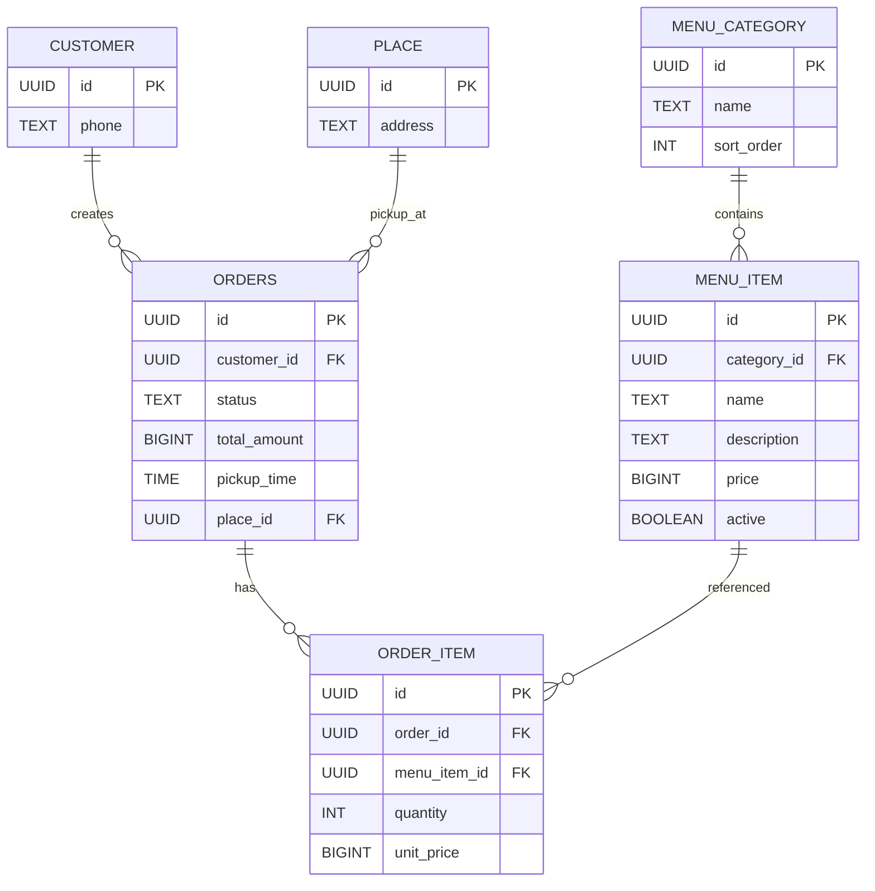

# Схема базы данных (логическая)

## Дополнительные объекты
- `order_summary_view` — агрегированная витрина по заказам (клиент, точка, сумма, количество позиций).
- `recalculate_order_total(order_id)` — пересчет суммы заказа по строкам `order_item`.
